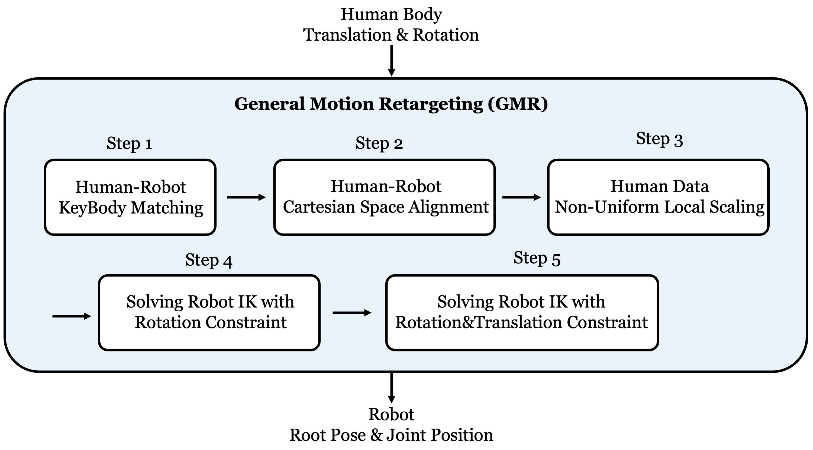
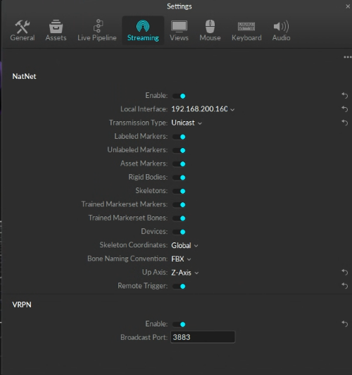

# GMR: General Motion Retargeting

  <a href="https://arxiv.org/abs/2505.02833">
    
  </a> <a href="https://arxiv.org/abs/2510.02252">
    
  </a> <a href="https://opensource.org/licenses/MIT">
    
  </a> <a href="https://github.com/YanjieZe/GMR/releases">
    
  </a> <a href="https://x.com/ZeYanjie/status/1952446745696469334">
    
  </a> <a href="https://yanjieze.github.io/humanoid-foundation/#GMR">
    
  </a> <a href="https://www.bilibili.com/video/BV1p1nazeEzC/?share_source=copy_web&vd_source=c76e3ab14ac3f7219a9006b96b4b0f76">
    
  </a>




#### Key features of GMR:
- Real-time high-quality retargeting, unlock the potential of real-time whole-body teleoperation, i.e., [TWIST](https://github.com/YanjieZe/TWIST).
- Carefully tuned for good performance of RL tracking policies.
- Support multiple humanoid robots and multiple human motion data formats (See our table below).

> [!NOTE]
> If you want this repo to support a new robot or a new human motion data format, send the robot files (`.xml`, `.urdf`, and meshes) / human motion data to <a href="mailto:lastyanjieze@gmail.com">Yanjie Ze</a> or create an issue, we will support it as soon as possible. And please make sure the robot files you sent can be open-sourced in this repo.

This repo is licensed under the [MIT License](LICENSE).


# News & Updates
- **2026-01-21:** GMR now supports [Xsens](https://www.xsens.com/) BVH offline data.
- **2026-01-12:** GMR now supports [Fourier GR3](https://www.fftai.com/), the 17th humanoid robot in the repo.
- **2025-12-02:** GMR now supports [TWIST2](https://yanjieze.com/TWIST2), which utilizes [XRoboToolkit SDK](https://github.com/XR-Robotics/XRoboToolkit-PC-Service).
- **2025-11-17:** To join our community for discussions, you can add my WeChat contact [QR Code](https://yanjieze.com/TWIST2/images/my_wechat.jpg) with info like "[GMR] [Your Name] [Your Affiliation]".
- **2025-11-08:** [MimicKit] from Jason Peng now supports GMR format. Check [here](https://github.com/xbpeng/MimicKit/tree/main/tools/gmr_to_mimickit).
- **2025-10-15:** Now supporting [PAL Robotics' Talos](https://pal-robotics.com/robot/talos/), the 15th humanoid robot.
- **2025-10-14:** GMR now supports [Nokov](https://www.nokov.com/) BVH data.
- **2025-10-14:** Add a doc on ik config. See [DOC.md](DOC.md)
- **2025-10-09:** Check [TWIST](https://github.com/YanjieZe/TWIST) open-sourced code for RL motion tracking.
- **2025-10-02:** Tech report for GMR is now on [arXiv](https://arxiv.org/abs/2510.02252).
- **2025-10-01:** GMR now supports converting GMR pickle files to CSV (for beyondmimic), check `scripts/batch_gmr_pkl_to_csv.py`.
- **2025-09-25:** An introduction on GMR is available on [Bilibili](https://www.bilibili.com/video/BV1p1nazeEzC/?share_source=copy_web&vd_source=c76e3ab14ac3f7219a9006b96b4b0f76).
- **2025-09-16:** GMR now supports to use [GVHMR](https://github.com/zju3dv/GVHMR) for extracting human pose from **monocular video** and retargeting to robot.
- **2025-09-12:** GMR now supports [Tienkung](https://github.com/Open-X-Humanoid/TienKung-Lab), the 14th humanoid robot in the repo.
- **2025-08-30:** GMR now supports [Unitree H1 2](https://www.unitree.com/cn/h1) and [PND Adam Lite](https://pndbotics.com/), the 12th and 13th humanoid robots in the repo.
- **2025-08-28:** GMR now supports [Booster T1](https://www.boosterobotics.com/) for both 23dof and 29dof.
- **2025-08-28:** GMR now supports using exported offline FBX motion data from [OptiTrack](https://www.optitrack.com/). 
- **2025-08-27:** GMR now supports [Berkeley Humanoid Lite](https://github.com/HybridRobotics/Berkeley-Humanoid-Lite-Assets), the 11th humanoid robot in the repo.
- **2025-08-24:** GMR now supports [Unitree H1](https://www.unitree.com/h1/), the 10th humanoid robot in the repo.
- **2025-08-24:** GMR now supports velocity limits for the robot motors, `use_velocity_limit=True` by default in `GeneralMotionRetargeting` class (and we use 3*pi as the velocity limit by default); we also add printing of robot DoF/Body/Motor names and their IDs by default, and you can access them via `robot_dof_names`, `robot_body_names`, and `robot_motor_names` attributes.
- **2025-08-10:** GMR now supports [Booster K1](https://www.boosterobotics.com/), the 9th robot in the repo.
- **2025-08-09:** GMR now supports *Unitree G1 with Dex31 hands*.
- **2025-08-07:** GMR now supports [Galexea R1 Pro](https://galaxea-dynamics.com/) (this is a wheeled humanoid robot!) and [KUAVO](https://www.kuavo.ai/), the 7th and 8th humanoid robots in the repo.
- **2025-08-06:** GMR now supports [HighTorque Hi](https://www.hightorquerobotics.com/hi/), the 6th humanoid robot in the repo.
- **2025-08-04:** Initial release of GMR. Check our [twitter post](https://x.com/ZeYanjie/status/1952446745696469334).

## Demos

<table>
  <tr>
    <td align="center" width="20%">
      <b>Demo 1</b><br>
      Retargeting LAFAN1 dancing motion to 5 robots.<br>
      <video src="https://github.com/user-attachments/assets/23566fa5-6335-46b9-957b-4b26aed11b9e" width="200" controls></video>
    </td>
    <td align="center" width="20%">
      <b>Demo 2</b><br>
      Galexea R1 Pro robot (view 1).<br>
      <video src="https://github.com/user-attachments/assets/903ed0b0-0ac5-4226-8f82-5a88631e9b7c" width="200" controls></video>
    </td>
    <td align="center" width="20%">
      <b>Demo 3</b><br>
      Galexea R1 Pro robot (view 2).<br>
      <video src="https://github.com/user-attachments/assets/deea0e64-f1c6-41bc-8661-351682006d5d" width="200" controls></video>
    </td>
    <td align="center" width="20%">
      <b>Demo 4</b><br>
      Switching robots by changing one argument.<br>
      <video src="https://github.com/user-attachments/assets/03f10902-c541-40b1-8104-715a5759fd5e" width="200" controls></video>
    </td>
    <td align="center" width="20%">
      <b>Demo 5</b><br>
      HighTorque robot doing a twist dance.<br>
      <video src="https://github.com/user-attachments/assets/1d3e663b-f29e-41b1-8e15-5c0deb6a4a5c" width="200" controls></video>
    </td>
  </tr>

  <tr>
    <td align="center">
      <b>Demo 6</b><br>
      Kuavo robot picking up a box.<br>
      <video src="https://github.com/user-attachments/assets/02fc8f41-c363-484b-a329-4f4e83ed5b80" width="200" controls></video>
    </td>
    <td align="center">
      <b>Demo 7</b><br>
      Unitree H1 robot doing a ChaCha dance.<br>
      <video src="https://github.com/user-attachments/assets/28ee6f0f-be30-42bb-8543-cf1152d97724" width="200" controls></video>
    </td>
    <td align="center">
      <b>Demo 8</b><br>
      Booster T1 robot jumping (view 1).<br>
      <video src="https://github.com/user-attachments/assets/2c75a146-e28f-4327-930f-5281bfc2ca9c" width="200" controls></video>
    </td>
    <td align="center">
      <b>Demo 9</b><br>
      Booster T1 robot jumping (view 2).<br>
      <video src="https://github.com/user-attachments/assets/ff10c7ef-4357-4789-9219-23c6db8dba6d" width="200" controls></video>
    </td>
    <td align="center">
      <b>Demo 10</b><br>
      Unitree H1-2 robot jumping.<br>
      <video src="https://github.com/user-attachments/assets/2382d8ce-7902-432f-ab45-348a11eeb312" width="200" controls></video>
    </td>
  </tr>

  <tr>
    <td align="center">
      <b>Demo 11</b><br>
      PND Adam Lite robot.<br>
      <video src="https://github.com/user-attachments/assets/a8ef1409-88f1-4393-9cd0-d2b14216d2a4" width="200" controls></video>
    </td>
    <td align="center">
      <b>Demo 12</b><br>
      Tienkung robot walking.<br>
      <video src="https://github.com/user-attachments/assets/7a775ecc-4254-450c-a3eb-49e843b8e331" width="200" controls></video>
    </td>
    <td align="center">
      <b>Demo 13</b><br>
      Extracting human pose (GVHMR + GMR).<br>
      <a href="https://www.bilibili.com/video/BV1Tnpmz9EaE">▶ Watch on Bilibili</a>
    </td>
    <td align="center">
      <b>Demo 14</b><br>
      PAL Robotics’ Talos robot fighting.<br>
      <video src="https://github.com/user-attachments/assets/3ec0bf80-80c1-4181-a623-dc2b072c2ca2" width="200" controls></video>
    </td>
    <td align="center">
      <b>Demo 15</b><br>
      (Optional placeholder if you add a new one later!)<br>
      <i>Coming soon...</i>
    </td>
  </tr>
</table>


## Supported Robots and Data Formats


| Assigned ID | Robot/Data Format | Robot DoF | SMPLX ([AMASS](https://amass.is.tue.mpg.de/), [OMOMO](https://github.com/lijiaman/omomo_release)) | BVH [LAFAN1](https://github.com/ubisoft/ubisoft-laforge-animation-dataset)| FBX ([OptiTrack](https://www.optitrack.com/)) |  BVH [Nokov](https://www.nokov.com/) | PICO ([XRoboToolkit](https://github.com/XR-Robotics/XRoboToolkit-PC-Service)) | More formats coming soon | 
| --- | --- | --- | --- | --- | --- | --- | --- | --- |
| 0 | Unitree G1 `unitree_g1` | Leg (2\*6) + Waist (3) + Arm (2\*7) = 29 | ✅ | ✅ | ✅ |  ✅ | ✅ |
| 1 | Unitree G1 with Hands `unitree_g1_with_hands` | Leg (2\*6) + Waist (3) + Arm (2\*7) + Hand (2\*7) = 43 | ✅ | ✅ | ✅ | TBD | TBD |
| 2 | Unitree H1 `unitree_h1` | Leg (2\*5) + Waist (1) + Arm (2\*4) = 19 | ✅ | TBD | TBD | TBD | TBD |
| 3 | Unitree H1 2 `unitree_h1_2` | Leg (2\*6) + Waist (1) + Arm (2\*7) = 27 | ✅ | TBD | TBD | TBD | TBD |
| 4 | Booster T1 `booster_t1` | TBD | ✅ |  TBD  | TBD | TBD |
| 5 | Booster T1 29dof `booster_t1_29dof` | TBD | ✅ |  ✅  | TBD | TBD |
| 6 | Booster K1 `booster_k1` | Neck (2) + Arm (2\*4) + Leg (2\*6) = 22 | ✅ | TBD | TBD | TBD |
| 7 | Stanford ToddlerBot `stanford_toddy` | TBD | ✅ | ✅ | TBD | TBD |
| 8 | Fourier N1 `fourier_n1` | TBD | ✅ | ✅ | TBD | TBD |
| 9 | ENGINEAI PM01 `engineai_pm01` | TBD | ✅ | ✅ | TBD | TBD |
| 10 | HighTorque Hi `hightorque_hi` | Head (2) + Arm (2\*5) + Waist (1) + Leg (2\*6) = 25 | ✅ | TBD | TBD | TBD |
| 11 | Galaxea R1 Pro `galaxea_r1pro` (this is a wheeled robot!) |  Base (6) + Torso (4) + Arm (2*7) = 24 | ✅ | TBD | TBD | TBD |
| 12 | Kuavo `kuavo_s45` |  Head (2) + Arm (2\*7) + Leg (2\*6) = 28 | ✅ | TBD | TBD | TBD |
| 13 | Berkeley Humanoid Lite `berkeley_humanoid_lite` (need further tuning) | Leg (2\*6) + Arm (2\*5) = 22 | ✅ | TBD | TBD | TBD |
| 14 | PND Adam Lite `pnd_adam_lite`  | Leg (2\*6) + Waist (3) + Arm (2\*5) = 25 | ✅ | TBD | TBD | TBD |
| 15 | Tienkung `tienkung`  | Leg (2\*6) + Arm (2\*4) = 20 | ✅ | TBD | TBD | TBD |
| 16 | PAL Robotics' Talos `pal_talos`  | Head (2) + Arm (2\*7) + Waist (2) + Leg (2\*6) = 30 | ✅ | TBD | TBD | TBD |
| 17 | Fourier GR3 `fourier_gr3`  | Head (2) + Arm (2\*7) + Waist (3) + Leg (2\*6) = 31 | ✅ | TBD | TBD | TBD |
| More robots coming soon ! |
| 18 | AgiBot A2 `agibot_a2` | TBD | TBD | TBD | TBD | TBD |
| 19 | OpenLoong `openloong` | TBD | TBD | TBD | TBD | TBD |


## Installation

> [!NOTE]
> The code is tested on Ubuntu 22.04/20.04.

First create your conda environment:

```bash
conda create -n gmr python=3.10 -y
conda activate gmr
```

Then, install GMR:

```bash
pip install -e .
```

After installing SMPLX, change `ext` in `smplx/body_models.py` from `npz` to `pkl` if you are using SMPL-X pkl files.

And to resolve some possible rendering issues:

```bash
conda install -c conda-forge libstdcxx-ng -y
```

## Data Preparation

[[SMPLX](https://github.com/vchoutas/smplx) body model] download SMPL-X body models to `assets/body_models` from [SMPL-X](https://smpl-x.is.tue.mpg.de/) and then structure as follows:
```bash
- assets/body_models/smplx/
-- SMPLX_NEUTRAL.pkl
-- SMPLX_FEMALE.pkl
-- SMPLX_MALE.pkl
```

[[AMASS](https://amass.is.tue.mpg.de/) motion data] download raw SMPL-X data to any folder you want from [AMASS](https://amass.is.tue.mpg.de/). NOTE: Do not download SMPL+H data.

[[OMOMO](https://github.com/lijiaman/omomo_release) motion data] download raw OMOMO data to any folder you want from [this google drive file](https://drive.google.com/file/d/1tZVqLB7II0whI-Qjz-z-AU3ponSEyAmm/view?usp=sharing). And process the data into the SMPL-X format using `scripts/convert_omomo_to_smplx.py`.

[[LAFAN1](https://github.com/ubisoft/ubisoft-laforge-animation-dataset) motion data] download raw LAFAN1 bvh files from [the official repo](https://github.com/ubisoft/ubisoft-laforge-animation-dataset), i.e., [lafan1.zip](https://github.com/ubisoft/ubisoft-laforge-animation-dataset/blob/master/lafan1/lafan1.zip).


## Human/Robot Motion Data Formulation

To better use this library, you can first have an understanding of the human motion data we use and the robot motion data we obtain.

Each frame of **human motion data** is formulated as a dict of (human_body_name, 3d global translation + global rotation). The rotation is usually represented as quaternion (with wxyz order by default, to align with mujoco).

Each frame of **robot motion data** can be understood as a tuple of (robot_base_translation, robot_base_rotation, robot_joint_positions).

## Usage

### [NEW] PICO Streaming to Robot (TWIST2)

Install PICO SDK:
1. On your PICO, install PICO SDK: see [here](https://github.com/XR-Robotics/XRoboToolkit-Unity-Client/releases/).
2. On your own PC, 
    - Download [deb package for ubuntu 22.04](https://github.com/XR-Robotics/XRoboToolkit-PC-Service/releases/download/v1.0.0/XRoboToolkit_PC_Service_1.0.0_ubuntu_22.04_amd64.deb), or build from the [repo source](https://github.com/XR-Robotics/XRoboToolkit-PC-Service).
    - To install, use command
        ```bash
        sudo dpkg -i XRoboToolkit_PC_Service_1.0.0_ubuntu_22.04_amd64.deb
        ```
        then you should see `xrobotoolkit-pc-service` in your APPs. remember to start this app before you do teleopperation.
    - Build PICO PC Service SDK and Python SDK for PICO streaming:
        ```bash
        conda activate gmr

        git clone https://github.com/YanjieZe/XRoboToolkit-PC-Service-Pybind.git
        cd XRoboToolkit-PC-Service-Pybind

        mkdir -p tmp
        cd tmp
        git clone https://github.com/XR-Robotics/XRoboToolkit-PC-Service.git
        cd XRoboToolkit-PC-Service/RoboticsService/PXREARobotSDK 
        bash build.sh
        cd ../../../..
        

        mkdir -p lib
        mkdir -p include
        cp tmp/XRoboToolkit-PC-Service/RoboticsService/PXREARobotSDK/PXREARobotSDK.h include/
        cp -r tmp/XRoboToolkit-PC-Service/RoboticsService/PXREARobotSDK/nlohmann include/nlohmann/
        cp tmp/XRoboToolkit-PC-Service/RoboticsService/PXREARobotSDK/build/libPXREARobotSDK.so lib/
        # rm -rf tmp

        # Build the project
        conda install -c conda-forge pybind11
        pip uninstall -y xrobotoolkit_sdk
        python setup.py install
        ```

You should be all set!

To try it, check [this script from TWIST2](https://github.com/amazon-far/TWIST2/blob/master/teleop.sh):
```bash
bash teleop.sh
```
You should be able to see the retargeted robot motion in a mujoco window.

### Retargeting from SMPL-X (AMASS, OMOMO) to Robot

> [!NOTE]
> NOTE: after install SMPL-X, change `ext` in `smplx/body_models.py` from `npz` to `pkl` if you are using SMPL-X pkl files.

Retarget a single motion:

```bash
python scripts/smplx_to_robot.py --smplx_file <path_to_smplx_data> --robot <path_to_robot_data> --save_path <path_to_save_robot_data.pkl> --rate_limit
```

By default you should see the visualization of the retargeted robot motion in a mujoco window.
If you want to record video, add `--record_video` and `--video_path <your_video_path,mp4>`.

- `--rate_limit` is used to limit the rate of the retargeted robot motion to keep the same as the human motion. If you want it as fast as possible, remove `--rate_limit`.

Retarget a folder of motions:

```bash
python scripts/smplx_to_robot_dataset.py --src_folder <path_to_dir_of_smplx_data> --tgt_folder <path_to_dir_to_save_robot_data> --robot <robot_name>
```

By default there is no visualization for batch retargeting.

### Retargeting from GVHMR to Robot

First, install GVHMR by following [their official instructions](https://github.com/zju3dv/GVHMR/blob/main/docs/INSTALL.md).

And run their demo that can extract human pose from monocular video:

```bash
cd path/to/GVHMR
python tools/demo/demo.py --video=docs/example_video/tennis.mp4 -s
```

Then you should obtain the saved human pose data in `GVHMR/outputs/demo/tennis/hmr4d_results.pt`.

Then, run the command below to retarget the extracted human pose data to your robot:

```bash
python scripts/gvhmr_to_robot.py --gvhmr_pred_file <path_to_hmr4d_results.pt> --robot unitree_g1 --record_video
```


## Retargeting from BVH (LAFAN1, Nokov) to Robot

Retarget a single motion:

```bash
# single motion
python scripts/bvh_to_robot.py --bvh_file <path_to_bvh_data> --robot <path_to_robot_data> --save_path <path_to_save_robot_data.pkl> --rate_limit --format <format>
```

By default you should see the visualization of the retargeted robot motion in a mujoco window. 
- `--rate_limit` is used to limit the rate of the retargeted robot motion to keep the same as the human motion. If you want it as fast as possible, remove `--rate_limit`.
- `--format` is used to specify the format of the BVH data. Supported formats are `lafan1` and `nokov`.


Retarget a folder of motions:

```bash
python scripts/bvh_to_robot_dataset.py --src_folder <path_to_dir_of_bvh_data> --tgt_folder <path_to_dir_to_save_robot_data> --robot <robot_name>
```

By default there is no visualization for batch retargeting.

```bash
python scripts/bvh_to_robot.py \
  --bvh_file BVH_data/Take_011_Skeleton0.bvh \
  --robot unitree_g1 \
  --format nokov \
  --motion_fps 30
```


## Retargeting from Xsens to Robot

### Offline: Xsens BVH to Robot

#### Visualize Xsens BVH Data using MuJoCo

Install PyQt6:
```bash
pip install PyQt6 PyQt6-Qt6 PyQt6-sip
```


```bash
python general_motion_retargeting/utils/xsens_vendor/mujoco_xsens_bvh_view.py \
  --bvh_file <path_to_dir_of_bvh_data> \
  --scale <displacement scaling size> \
  --reset_to_zero
```
like
```bash
python general_motion_retargeting/utils/xsens_vendor/mujoco_xsens_bvh_view.py \
  --scale 0.01 \
  --bvh_file assets/xsens_bvh_test/251021_04_boxing_120Hz_cm_3DsMax.bvh \
  --reset_to_zero
```

- `--start` is used to specify the initial processing frame. If no input is given, processing will start from the first frame by default.

- `--end` is used to specify the final processing frame. If not input, it will be processed by default to the last frame.

- `--reset_to_zero` is used to reset the displacement and Z-axis rotation to zero.This function, when used in combination with `--start`, will set the data to the initial zero position very well.Because sometimes the first one or two frames of some datasets differ too much from the subsequent data, these data need to be discarded.

- `--scale` is used to set the scaling value of the displacement, which depends on the relationship between the unit used for the displacement in the dataset and the meter.

- ##### Before using it, you must install PyQt6. `pip install PyQt6`
- ##### Upon executing this command, a UI interface will be launched, enabling you to adjust the angle values for each channel in the x, y, and z directions of every joint. After completing the adjustments, click the `"Apply and Preview"` button, which will generate an `offset.json` file locally and perform a MuJoCo visualization playback of the BVH file. When running `xsens_bvh_to_robot.py`, it will read the data from this JSON file. Therefore, you need to execute `mujoco_xsens_bvh_view.py` prior to using `xsens_bvh_to_robot.py` for motion retargeting, to ensure that the `offset.json` file exists locally.

#### Retarget a single motion:
```bash
# single motion
python scripts/xsens_bvh_to_robot.py \
  --bvh_file <path_to_bvh_data> \
  --robot <path_to_robot_data> \
  --save_path <path_to_save_robot_data.pkl> \
  --rate_limit \
  --start <number of the first frame> \
  --scale <displacement scaling size> \
  --reset_to_zero \
  --bvh_format <exported bvh format>
```
like
```bash
python scripts/xsens_bvh_to_robot.py  \
  --robot unitree_h1_2 \
  --scale 0.01 \
  --reset_to_zero \
  --bvh_format 3DSM \
  --bvh_file assets/xsens_bvh_test/251021_04_boxing_120Hz_cm_3DsMax.bvh \
  --save_path retargeting_data/h1/251021_04_boxing_120Hz_cm_3DsMax.pkl
```
##### By default you should see the visualization of the retargeted robot motion in a mujoco window. 
- `--rate_limit` is used to limit the rate of the retargeted robot motion to keep the same as the human motion. If you want it as fast as possible, remove `--rate_limit`.

- `--start` is used to specify the initial processing frame. If no input is given, processing will start from the first frame by default.

- `--end` is used to specify the final processing frame. If not input, it will be processed by default to the last frame.

- `--reset_to_zero` is used to reset the displacement and Z-axis rotation to zero.This function, when used in combination with `--start`, will set the data to the initial zero position very well.Because sometimes the first one or two frames of some datasets differ too much from the subsequent data, these data need to be discarded.

- `--scale` is used to set the scaling value of the displacement, which depends on the relationship between the unit used for the displacement in the dataset and the meter.

##### ！！！！！！！！！！！！！！！！！！ ATTENTION ！！！！！！！！！！！！！！！！！！！！
- `--bvh_format` is used to set the format of the bvh being parsed. In the Xsens MVN software, BVH files in three formats can be exported. There will be some differences among BVH files in different formats. Here I recommend using the 3D Studio Max format.(In fact, I have not yet completed the parsing of data in other formats.)

- The exported pkl file will represent quaternions in the `wxyz` format. ^ _ ^

---

### Online Streaming (Xsens MVN)

Stream live motion data from **Xsens MVN Software** directly into GMR for real-time robot retargeting.

#### 1. Install the Xsens MVN UDP Data Parser

The `xsens_mvn_robot_python` library parses the Xsens MVN network datagram (Position + Orientation in quaternion format) into Python-accessible data structures. Install the correct `.whl` file for your Python version.

```bash
# Clone the parser repository
git clone https://github.com/jiminghe/xsens_mvn_robot_python.git
cd xsens_mvn_robot_python

# Install the matching wheel for your Python version
# Example for Python 3.10:
pip install xsens_mvn_robot_python-*-cp310-*.whl
```

> Select the `.whl` file whose filename contains your Python version tag (e.g. `cp310` for Python 3.10, `cp38` for Python 3.8). This library handles UDP socket binding and datagram unpacking automatically.

#### 2. Configure the Xsens MVN Network Streamer

Launch **Xsens MVN Software** on either Windows or Linux. You can stream from a live recording session while wearing the Xsens Link / Awinda suit, or replay a previously recorded `.mvn` file.

| Step | Action |
|---|---|
| 1 | Click **Options → Network Streamer** |
| 2 | In the pop-up window, click **Add** to create a new stream destination |
| 3 | Set the **Host Address** (see table below) |
| 4 | Under Network Streamer Options, tick **Position + Orientation (Quaternion)** only |
| 5 | No other data sources are needed for GMR retargeting |
| 6 | Click **OK** — confirm green status on the streamer |

**Host Address Reference:**

| Scenario | Host Address Setting |
|---|---|
| MVN on the same Linux machine (MVN Linux) | `127.0.0.1` (localhost) |
| MVN on Windows → streaming to Ubuntu (same LAN) | Ubuntu IP address, e.g. `192.168.1.10` |

> **Important:** When streaming from a Windows PC to an Ubuntu computer, ensure both machines are on the same LAN. Disable Windows Firewall for the MVN application or create an inbound UDP rule on the MVN default port (`9763`).

#### 3. Run the GMR Live Streaming Script

With the Xsens MVN Network Streamer active and the conda environment loaded, run the live-streaming retargeting script. A MuJoCo window will open showing the retargeted Unitree G1 robot mirroring your movements in real time.

```bash
# Activate the GMR environment
conda activate gmr

# Run the Xsens live streaming retargeting script
python scripts/xsens_live_streaming.py
```

### Retargeting from FBX (OptiTrack) to Robot

#### Offline FBX Files

Retarget a single motion:

1. Install `fbx_sdk` by following [these instructions](https://github.com/nv-tlabs/ASE/tree/main/ase/poselib#importing-from-fbx) and [these instructions](https://github.com/nv-tlabs/ASE/issues/61#issuecomment-2670315114). You will probably need a new conda environment for this.

2. Activate the conda environment where you installed `fbx_sdk`.
Use the following command to extract motion data from your `.fbx` file:

```bash
cd third_party
python poselib/fbx_importer.py --input <path_to_fbx_file.fbx> --output <path_to_save_motion_data.pkl> --root-joint <root_joint_name> --fps <fps>
```

3. Then, run the command below to retarget the extracted motion data to your robot:

```bash
conda activate gmr
# single motion
python scripts/fbx_offline_to_robot.py --motion_file <path_to_saved_motion_data.pkl> --robot <path_to_robot_data> --save_path <path_to_save_robot_data.pkl> --rate_limit
```

By default you should see the visualization of the retargeted robot motion in a mujoco window. 

- `--rate_limit` is used to limit the rate of the retargeted robot motion to keep the same as the human motion. If you want it as fast as possible, remove `--rate_limit`.

#### Online Streaming

We provide the script to use OptiTrack MoCap data for real-time streaming and retargeting.

Usually you will have two computers, one is the server that installed with Motive (Desktop APP for OptiTrack) and the other is the client that installed with GMR.

Find the server ip (the computer that installed with Motive) and client ip (your computer). Set the streaming as follows:



And then run:

```bash
python scripts/optitrack_to_robot.py --server_ip <server_ip> --client_ip <client_ip> --use_multicast False --robot unitree_g1
```

You should see the visualization of the retargeted robot motion in a mujoco window.

### Visualize saved robot motion

Visualize a single motions:

```bash
python scripts/vis_robot_motion.py --robot <robot_name> --robot_motion_path <path_to_save_robot_data.pkl>
```

If you want to record video, add `--record_video` and `--video_path <your_video_path,mp4>`.

Visualize a folder of motions:

```bash
python scripts/vis_robot_motion_dataset.py --robot <robot_name> --robot_motion_folder <path_to_save_robot_data_folder>
```

After launching the MuJoCo visualization window and clicking on it, you can use the following keyboard controls::
* `[`: play the previous motion
* `]`: play the next motion
* `space`: toggle play/pause

## Speed Benchmark

| CPU | Retargeting Speed |
| --- | --- |
| AMD Ryzen Threadripper 7960X 24-Cores | 60~70 FPS |
| 13th Gen Intel Core i9-13900K 24-Cores | 35~45 FPS |
| TBD | TBD |

## Citation

If you find our code useful, please consider citing our related papers:

```bibtex
@article{joao2025gmr,
  title={Retargeting Matters: General Motion Retargeting for Humanoid Motion Tracking},
  author= {Joao Pedro Araujo and Yanjie Ze and Pei Xu and Jiajun Wu and C. Karen Liu},
  year= {2025},
  journal= {arXiv preprint arXiv:2510.02252}
}
```

```bibtex
@article{ze2025twist,
  title={TWIST: Teleoperated Whole-Body Imitation System},
  author= {Yanjie Ze and Zixuan Chen and João Pedro Araújo and Zi-ang Cao and Xue Bin Peng and Jiajun Wu and C. Karen Liu},
  year= {2025},
  journal= {arXiv preprint arXiv:2505.02833}
}
```

and this github repo:

```bibtex
@software{ze2025gmr,
  title={GMR: General Motion Retargeting},
  author= {Yanjie Ze and João Pedro Araújo and Jiajun Wu and C. Karen Liu},
  year= {2025},
  url= {https://github.com/YanjieZe/GMR},
  note= {GitHub repository}
}
```

## Known Issues

Designing a single config for all different humans is not trivial. We observe some motions might have bad retargeting results. If you observe some bad results, please let us know! We now have a collection of such motions in [TEST_MOTIONS.md](TEST_MOTIONS.md).

## Acknowledgement

Our IK solver is built upon [mink](https://github.com/kevinzakka/mink) and [mujoco](https://github.com/google-deepmind/mujoco). Our visualization is built upon [mujoco](https://github.com/google-deepmind/mujoco). The human motion data we try includes [AMASS](https://amass.is.tue.mpg.de/), [OMOMO](https://github.com/lijiaman/omomo_release), and [LAFAN1](https://github.com/ubisoft/ubisoft-laforge-animation-dataset).

The original robot models can be found at the following locations:

* [Berkley Humanoid Lite](https://github.com/HybridRobotics/Berkeley-Humanoid-Lite-Assets): CC-BY-SA-4.0 license
* [Booster K1](https://www.boosterobotics.com/)
* [Booster T1](https://booster.feishu.cn/wiki/UvowwBes1iNvvUkoeeVc3p5wnUg) ([English](https://booster.feishu.cn/wiki/DtFgwVXYxiBT8BksUPjcOwG4n4f))
* [EngineAI PM01](https://github.com/engineai-robotics/engineai_ros2_workspace): [Link to file](https://github.com/engineai-robotics/engineai_ros2_workspace/blob/community/src/simulation/mujoco/assets/resource) 
* [Fourier N1](https://github.com/FFTAI/Wiki-GRx-Gym): [Link to file](https://github.com/FFTAI/Wiki-GRx-Gym/tree/FourierN1/legged_gym/resources/robots/N1)
* [Galaxea R1 Pro](https://galaxea-dynamics.com/): MIT license
* [HighToqure Hi](https://www.hightorquerobotics.com/hi/)
* [LEJU Kuavo S45](https://gitee.com/leju-robot/kuavo-ros-opensource/blob/master/LICENSE): MIT license
* [PAL Robotics' Talos](https://github.com/google-deepmind/mujoco_menagerie): [Link to file](https://github.com/google-deepmind/mujoco_menagerie/tree/main/pal_talos)
* [Toddlerbot](https://github.com/hshi74/toddlerbot): [Link to file](https://github.com/hshi74/toddlerbot/tree/main/toddlerbot/descriptions/toddlerbot_active)
* [Unitree G1](https://github.com/unitreerobotics/unitree_ros): [Link to file](https://github.com/unitreerobotics/unitree_ros/tree/master/robots/g1_description)
