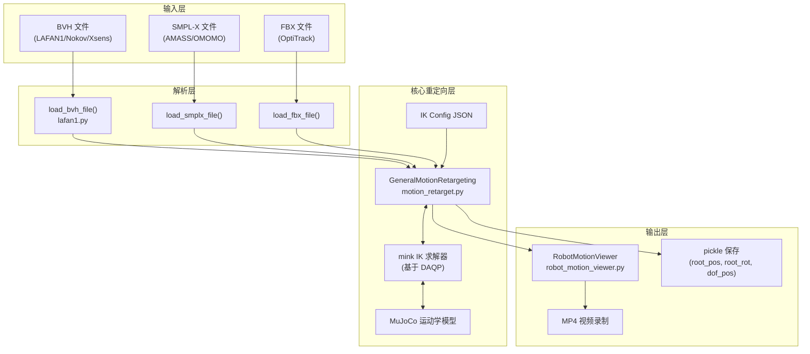
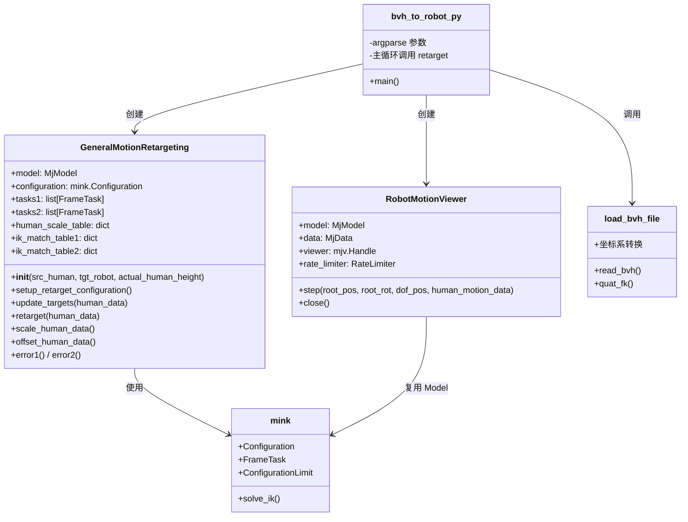
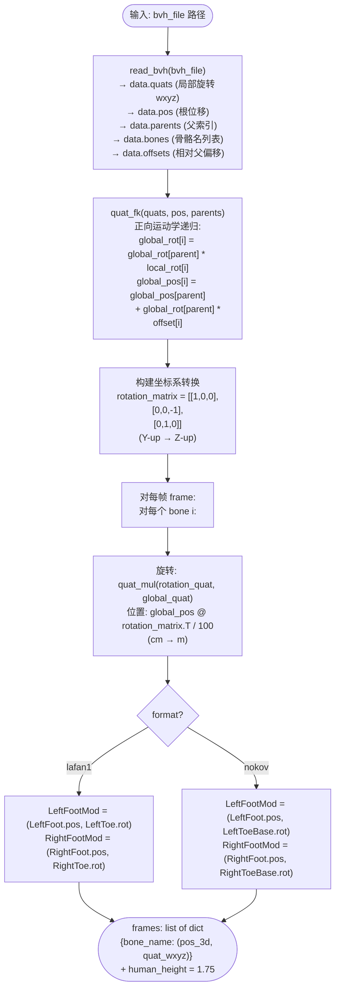
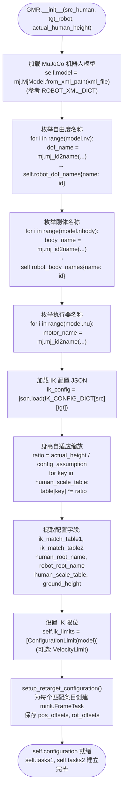
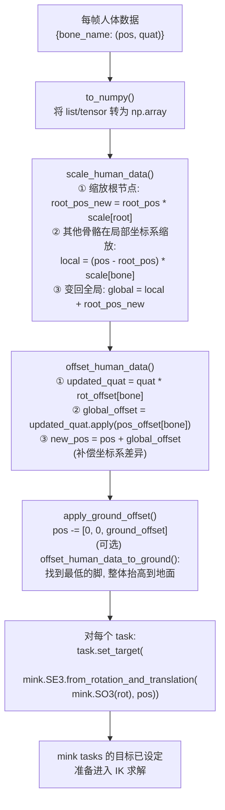
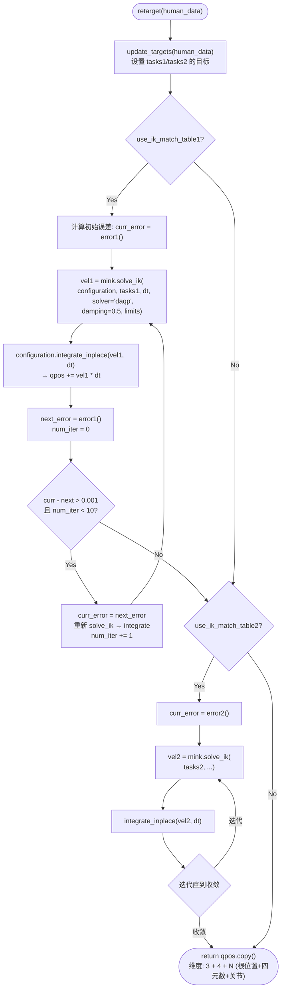
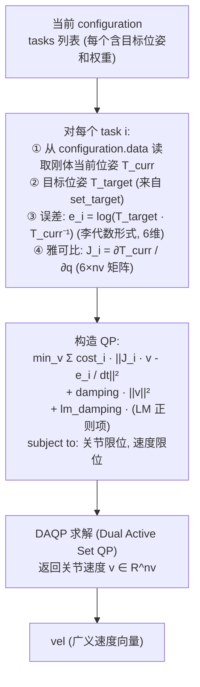
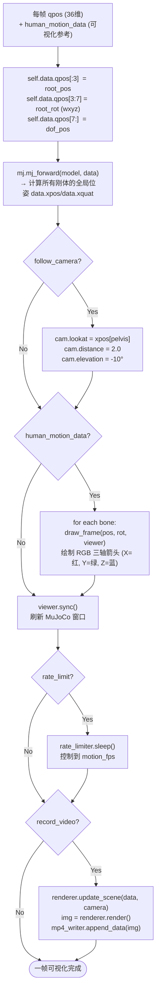
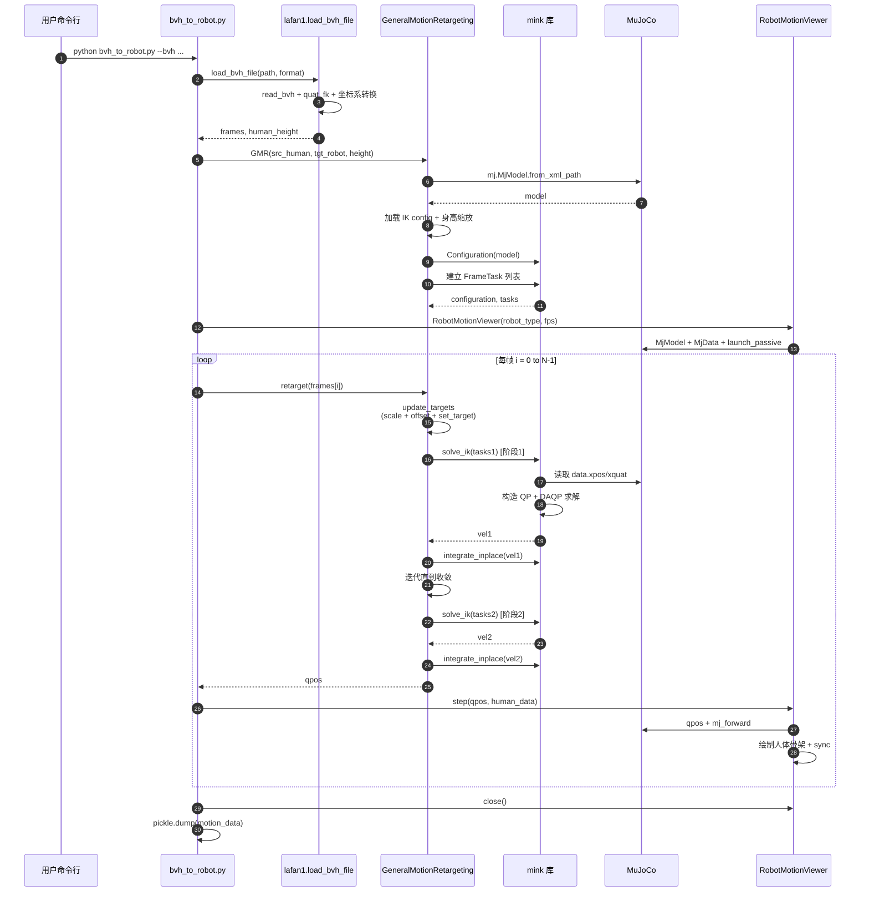

# GMR 架构全景：从 BVH 到机器人的完整重定向流程

本文档逐行解析 GMR（General Motion Retargeting）的完整架构与算法流程，从 BVH 文件解析到 IK 求解再到可视化的每一个步骤。

---

## 目录

1. [整体架构总览](#1-整体架构总览)
2. [核心组件关系图](#2-核心组件关系图)
3. [数据流：BVH → Robot qpos](#3-数据流bvh--robot-qpos)
4. [阶段一：BVH 文件解析](#4-阶段一bvh-文件解析)
5. [阶段二：GMR 初始化](#5-阶段二gmr-初始化)
6. [阶段三：人体数据预处理](#6-阶段三人体数据预处理)
7. [阶段四：两阶段 IK 求解](#7-阶段四两阶段-ik-求解)
8. [阶段五：可视化与保存](#8-阶段五可视化与保存)
9. [关键数学原理](#9-关键数学原理)

---

## 1. 整体架构总览



## 2. 核心组件关系图



## 3. 数据流：BVH → Robot qpos

```mermaid
flowchart LR
    A[".bvh 文件"]
    B["(frames, bones)<br/>四元数 + 根位移<br/>Y-up, cm"]
    C["dict{bone: (pos, quat)}<br/>Z-up, m"]
    D["缩放后的人体数据<br/>(适配机器人尺寸)"]
    E["应用偏移后的人体数据<br/>(对齐坐标系)"]
    F["mink.FrameTask 目标"]
    G["关节速度 vel"]
    H["qpos_new = qpos + vel*dt"]
    I["qpos: [root_pos(3), root_quat(4), dof(N)]"]
    J["MuJoCo 可视化 / pickle 保存"]

    A -->|read_bvh| B
    B -->|quat_fk + 坐标系转换| C
    C -->|scale_human_data| D
    D -->|offset_human_data| E
    E -->|task.set_target| F
    F -->|mink.solve_ik| G
    G -->|integrate_inplace| H
    H -->|迭代收敛| I
    I --> J
```



---

## 4. 阶段一：BVH 文件解析

**代码位置**：[lafan1.py](../general_motion_retargeting/utils/lafan1.py) 第 8-47 行

### 4.1 流程图



### 4.2 关键代码逐行解析

**代码位置**：`lafan1.py` 第 8-47 行

```python
# lafan1.py
def load_bvh_file(bvh_file, format="lafan1"):
    # ① 解析 BVH 文件
    data = read_bvh(bvh_file)
    # data.quats.shape  = (num_frames, num_bones, 4)  -- 每帧每骨骼的局部旋转 (wxyz)
    # data.pos.shape    = (num_frames, 3)             -- 每帧根节点位移 (cm, Y-up)
    # data.parents      = [-1, 0, 1, 2, ...]          -- 骨骼树的父索引
    # data.bones        = ["Hips", "Spine", ...]      -- 骨骼名

    # ② 正向运动学 (FK)
    global_data = utils.quat_fk(data.quats, data.pos, data.parents)
    # global_data[0].shape = (num_frames, num_bones, 4)  -- 全局旋转 (wxyz)
    # global_data[1].shape = (num_frames, num_bones, 3)  -- 全局位置 (cm)

    # ③ 构造坐标系转换 (Y-up BVH → Z-up 机器人)
    rotation_matrix = np.array([[1, 0, 0],
                                 [0, 0, -1],
                                 [0, 1, 0]])  # 将 Y→Z, Z→-Y, X→X
    rotation_quat = R.from_matrix(rotation_matrix).as_quat(scalar_first=True)

    frames = []
    for frame in range(data.pos.shape[0]):
        result = {}
        for i, bone in enumerate(data.bones):
            # ④ 旋转: 左乘坐标系变换四元数
            orientation = utils.quat_mul(rotation_quat, global_data[0][frame, i])

            # ⑤ 位置: 向量变换 + cm→m
            position = global_data[1][frame, i] @ rotation_matrix.T / 100

            result[bone] = [position, orientation]

        # ⑥ 构造 FootMod (脚位置 + 脚趾朝向)
        if format == "lafan1":
            result["LeftFootMod"]  = [result["LeftFoot"][0], result["LeftToe"][1]]
            result["RightFootMod"] = [result["RightFoot"][0], result["RightToe"][1]]
        elif format == "nokov":
            result["LeftFootMod"]  = [result["LeftFoot"][0], result["LeftToeBase"][1]]
            result["RightFootMod"] = [result["RightFoot"][0], result["RightToeBase"][1]]

        frames.append(result)

    human_height = 1.75   # 固定值 (也可以动态计算)
    return frames, human_height
```

### 4.3 为什么要构造 `FootMod`？

| 节点 | 含义 | IK 中的作用 |
|------|------|-----------|
| `LeftFoot` | BVH 中脚踝关节位置和朝向 | 位置准，但朝向是踝关节的朝向 |
| `LeftToe` | BVH 中脚趾关节位置和朝向 | 朝向更能代表脚掌朝向（脚掌平面的法向） |
| `LeftFootMod` | **脚的位置 + 脚趾的朝向** | 让机器人脚踝在位置匹配脚的同时，朝向正确 |

---

## 5. 阶段二：GMR 初始化

**代码位置**：[motion_retarget.py](../general_motion_retargeting/motion_retarget.py) 第 13-105 行

### 5.1 流程图



### 5.2 `__init__` 逐行解析

**代码位置**：`motion_retarget.py` 第 13-105 行

```python
def __init__(self, src_human, tgt_robot,
             actual_human_height=None,
             solver="daqp",          # 二次规划求解器
             damping=5e-1,           # IK 阻尼 (LM 法)
             verbose=True,
             use_velocity_limit=False):

    # ① 加载机器人 MuJoCo 模型
    self.xml_file = str(ROBOT_XML_DICT[tgt_robot])
    self.model = mj.MjModel.from_xml_path(self.xml_file)
    # self.model 包含: nv (DoF 数), nbody (刚体数), nu (执行器数)

    # ② 枚举 DoF
    self.robot_dof_names = {}
    for i in range(self.model.nv):
        dof_name = mj.mj_id2name(self.model, mj.mjtObj.mjOBJ_JOINT,
                                  self.model.dof_jntid[i])
        self.robot_dof_names[dof_name] = i

    # ③ 枚举刚体
    self.robot_body_names = {}
    for i in range(self.model.nbody):
        body_name = mj.mj_id2name(self.model, mj.mjtObj.mjOBJ_BODY, i)
        self.robot_body_names[body_name] = i

    # ④ 枚举执行器
    self.robot_motor_names = {}
    for i in range(self.model.nu):
        motor_name = mj.mj_id2name(self.model, mj.mjtObj.mjOBJ_ACTUATOR, i)
        self.robot_motor_names[motor_name] = i

    # ⑤ 加载 IK 配置
    with open(IK_CONFIG_DICT[src_human][tgt_robot]) as f:
        ik_config = json.load(f)

    # ⑥ 身高自适应
    if actual_human_height is not None:
        ratio = actual_human_height / ik_config["human_height_assumption"]
    else:
        ratio = 1.0
    for key in ik_config["human_scale_table"].keys():
        ik_config["human_scale_table"][key] *= ratio

    # ⑦ 提取字段
    self.ik_match_table1   = ik_config["ik_match_table1"]
    self.ik_match_table2   = ik_config["ik_match_table2"]
    self.human_root_name   = ik_config["human_root_name"]
    self.robot_root_name   = ik_config["robot_root_name"]
    self.use_ik_match_table1 = ik_config["use_ik_match_table1"]
    self.use_ik_match_table2 = ik_config["use_ik_match_table2"]
    self.human_scale_table = ik_config["human_scale_table"]
    self.ground = ik_config["ground_height"] * np.array([0, 0, 1])

    # ⑧ IK 最大迭代次数和求解器
    self.max_iter = 10
    self.solver = solver
    self.damping = damping

    # ⑨ 任务相关字典 (稍后填充)
    self.human_body_to_task1 = {}
    self.human_body_to_task2 = {}
    self.pos_offsets1 = {}
    self.rot_offsets1 = {}
    self.pos_offsets2 = {}
    self.rot_offsets2 = {}

    # ⑩ 配置 IK 限位
    self.ik_limits = [mink.ConfigurationLimit(self.model)]
    if use_velocity_limit:
        VELOCITY_LIMITS = {k: 3*np.pi for k in self.robot_motor_names.keys()}
        self.ik_limits.append(mink.VelocityLimit(self.model, VELOCITY_LIMITS))

    # ⑪ 建立 FrameTask
    self.setup_retarget_configuration()
```

### 5.3 `setup_retarget_configuration()` — 建立 IK 任务

**代码位置**：`motion_retarget.py` 第 107-147 行

```python
def setup_retarget_configuration(self):
    # mink.Configuration 是 IK 的"机器人当前状态"容器
    # 内部持有 qpos (广义坐标)、qvel (广义速度)
    self.configuration = mink.Configuration(self.model)

    self.tasks1 = []
    self.tasks2 = []

    # 遍历阶段1匹配表
    for frame_name, entry in self.ik_match_table1.items():
        body_name, pos_weight, rot_weight, pos_offset, rot_offset = entry

        # 权重都为0的条目跳过 (节省计算)
        if pos_weight != 0 or rot_weight != 0:
            # 创建 mink FrameTask:
            # - frame_name: 机器人上要控制的刚体 (如 "left_ankle_roll_link")
            # - position_cost: 位置误差权重 ||p_robot - p_target||² 的系数
            # - orientation_cost: 旋转误差权重
            # - lm_damping: Levenberg-Marquardt 阻尼
            task = mink.FrameTask(
                frame_name=frame_name,
                frame_type="body",
                position_cost=pos_weight,
                orientation_cost=rot_weight,
                lm_damping=1,
            )
            # 记录 "人体骨骼 → 机器人刚体任务" 的映射
            self.human_body_to_task1[body_name] = task
            self.pos_offsets1[body_name] = np.array(pos_offset) - self.ground
            self.rot_offsets1[body_name] = R.from_quat(rot_offset, scalar_first=True)
            self.tasks1.append(task)

    # 阶段2 同理
    for frame_name, entry in self.ik_match_table2.items():
        ...
```

---

## 6. 阶段三：人体数据预处理

**代码位置**：`motion_retarget.py` 第 150-313 行（含 `update_targets`、`scale_human_data`、`offset_human_data`、`apply_ground_offset` 等）

### 6.1 预处理流程图



### 6.2 `update_targets()` 逐行解析

**代码位置**：`motion_retarget.py` 第 150-170 行

```python
def update_targets(self, human_data, offset_to_ground=False):
    # 步骤 1: 转 numpy
    human_data = self.to_numpy(human_data)

    # 步骤 2: 按身高缩放 (局部坐标系)
    human_data = self.scale_human_data(
        human_data, self.human_root_name, self.human_scale_table
    )

    # 步骤 3: 应用 pos_offset / rot_offset (补偿几何/坐标系差异)
    human_data = self.offset_human_data(
        human_data, self.pos_offsets1, self.rot_offsets1
    )

    # 步骤 4: 应用整体地面偏移
    human_data = self.apply_ground_offset(human_data)

    # 步骤 5 (可选): 把脚压到地面
    if offset_to_ground:
        human_data = self.offset_human_data_to_ground(human_data)

    # 保存预处理后的数据 (用于可视化)
    self.scaled_human_data = human_data

    # 步骤 6: 设置每个 FrameTask 的目标位姿
    if self.use_ik_match_table1:
        for body_name in self.human_body_to_task1.keys():
            task = self.human_body_to_task1[body_name]
            pos, rot = human_data[body_name]
            # mink.SE3 是刚体变换: 旋转 + 平移
            task.set_target(
                mink.SE3.from_rotation_and_translation(mink.SO3(rot), pos)
            )

    if self.use_ik_match_table2:
        for body_name in self.human_body_to_task2.keys():
            task = self.human_body_to_task2[body_name]
            pos, rot = human_data[body_name]
            task.set_target(
                mink.SE3.from_rotation_and_translation(mink.SO3(rot), pos)
            )
```

### 6.3 `scale_human_data()` 的数学含义

**代码位置**：`motion_retarget.py` 第 243-266 行

```python
def scale_human_data(self, human_data, human_root_name, human_scale_table):
    root_pos, root_quat = human_data[human_root_name]

    # 根节点位置独立缩放 (通常控制机器人重心的总高度)
    scaled_root_pos = human_scale_table[human_root_name] * root_pos

    # 其他骨骼: 保持相对根节点的方向, 但距离按 scale 缩放
    human_data_local = {}
    for body_name in human_data.keys():
        if body_name not in human_scale_table:
            continue
        if body_name == human_root_name:
            continue
        # 转到以 root 为原点的局部系
        human_data_local[body_name] = (
            human_data[body_name][0] - root_pos
        ) * human_scale_table[body_name]

    # 变回全局 (以 scaled_root_pos 为新的根)
    human_data_global = {human_root_name: (scaled_root_pos, root_quat)}
    for body_name in human_data_local.keys():
        human_data_global[body_name] = (
            human_data_local[body_name] + scaled_root_pos,
            human_data[body_name][1]   # 旋转不变
        )

    return human_data_global
```

**几何解释**：
- 人体站立时，胸部在 Hips 上方 0.5m，手臂在肩部外侧 0.3m
- 机器人尺寸更小：胸部在 0.45m，手臂在 0.22m
- 缩放后：`胸部=0.5*0.9=0.45m` ✓，`手臂=0.3*0.75=0.225m` ✓

### 6.4 `offset_human_data()` 的数学含义

**代码位置**：`motion_retarget.py` 第 268-284 行

```python
def offset_human_data(self, human_data, pos_offsets, rot_offsets):
    offset_human_data = {}
    for body_name in human_data.keys():
        pos, quat = human_data[body_name]
        offset_human_data[body_name] = [pos, quat]

        # ① 旋转偏移: 在原朝向基础上右乘偏移
        #    结果 quat 表示"机器人刚体在当前人体骨骼姿态下应有的朝向"
        updated_quat = (
            R.from_quat(quat, scalar_first=True) * rot_offsets[body_name]
        ).as_quat(scalar_first=True)
        offset_human_data[body_name][1] = updated_quat

        # ② 位置偏移: 局部偏移通过新的朝向转到全局
        local_offset = pos_offsets[body_name]
        global_pos_offset = R.from_quat(
            updated_quat, scalar_first=True
        ).apply(local_offset)

        # ③ 叠加到全局位置
        offset_human_data[body_name][0] = pos + global_pos_offset

    return offset_human_data
```

**为什么要做偏移**：
- BVH 中 `LeftHand` 的原点在手腕中心，但机器人 `left_wrist_yaw_link` 的原点在手腕轴线上
- 两者有几厘米的几何差异，用 `pos_offset` 补偿
- BVH 骨骼的本地坐标轴（X沿骨骼延伸方向）和机器人刚体坐标轴方向不同，用 `rot_offset` 补偿

---

## 7. 阶段四：两阶段 IK 求解

**代码位置**：`motion_retarget.py` 第 173-234 行（`retarget`、`error1`、`error2`）

### 7.1 IK 求解流程图



### 7.2 `retarget()` 逐行解析

**代码位置**：`motion_retarget.py` 第 173-219 行

```python
def retarget(self, human_data, offset_to_ground=False):
    # ① 更新 IK 目标 (处理人体数据并设到每个 FrameTask)
    self.update_targets(human_data, offset_to_ground)

    # ② 阶段1 IK
    if self.use_ik_match_table1:
        curr_error = self.error1()   # 当前误差 (所有 task 的误差范数)
        dt = self.configuration.model.opt.timestep   # MuJoCo 时间步长

        # 第一次求解: QP 求解出关节速度 vel1
        vel1 = mink.solve_ik(
            self.configuration, self.tasks1, dt,
            self.solver, self.damping, self.ik_limits
        )
        # 积分更新: qpos_new = qpos_old + vel1 * dt (带四元数幂映射)
        self.configuration.integrate_inplace(vel1, dt)

        next_error = self.error1()
        num_iter = 0
        # 迭代直到误差不再显著下降
        while curr_error - next_error > 0.001 and num_iter < self.max_iter:
            curr_error = next_error
            dt = self.configuration.model.opt.timestep
            vel1 = mink.solve_ik(
                self.configuration, self.tasks1, dt,
                self.solver, self.damping, self.ik_limits
            )
            self.configuration.integrate_inplace(vel1, dt)
            next_error = self.error1()
            num_iter += 1

    # ③ 阶段2 IK (同样流程)
    if self.use_ik_match_table2:
        curr_error = self.error2()
        dt = self.configuration.model.opt.timestep
        vel2 = mink.solve_ik(
            self.configuration, self.tasks2, dt,
            self.solver, self.damping, self.ik_limits
        )
        self.configuration.integrate_inplace(vel2, dt)

        next_error = self.error2()
        num_iter = 0
        while curr_error - next_error > 0.001 and num_iter < self.max_iter:
            curr_error = next_error
            dt = self.configuration.model.opt.timestep
            vel2 = mink.solve_ik(
                self.configuration, self.tasks2, dt,
                self.solver, self.damping, self.ik_limits
            )
            self.configuration.integrate_inplace(vel2, dt)
            next_error = self.error2()
            num_iter += 1

    # ④ 返回机器人完整构型
    return self.configuration.data.qpos.copy()
```

### 7.3 `mink.solve_ik` 内部原理

虽然 `solve_ik` 来自 mink 库，但其数学本质如下：



**核心公式**：

对于每个 FrameTask（控制刚体 $b_i$ 到目标位姿 $T_i^*$）：

$$e_i = \log(T_i^{*} \cdot T_i^{-1}) \in \mathbb{R}^6 \quad (\text{李代数误差})$$

$$J_i = \frac{\partial T_i}{\partial q} \in \mathbb{R}^{6 \times n_v} \quad (\text{空间雅可比})$$

IK 变成如下 QP 问题：

$$\min_{\dot{q}} \sum_i w_i \| J_i \dot{q} - \frac{e_i}{\Delta t} \|^2 + \lambda \|\dot{q}\|^2$$

约束：

$$q^{-} \leq q + \dot{q}\Delta t \leq q^{+}, \quad \dot{q}^{-} \leq \dot{q} \leq \dot{q}^{+}$$

求解得到 $\dot{q}$，然后：

$$q \leftarrow q \oplus \dot{q} \Delta t$$

（$\oplus$ 表示在流形上的积分，对浮动基座的四元数部分用 $q_{\text{new}} = q \cdot \exp(\omega \Delta t / 2)$）

### 7.4 `integrate_inplace` 的流形积分

```python
# configuration.integrate_inplace(vel, dt) 内部
# 对自由度 i:
#   若是普通关节 (1-DoF):   q[i] += vel[i] * dt
#   若是球关节或浮动基座:    q[quat] = q[quat] ⊗ exp(vel[ω] * dt / 2)
#                          q[pos]  = q[pos]  + vel[v] * dt
```

这保证了在 SE(3) 流形上的正确积分，而不仅是欧氏线性累加。

### 7.5 误差计算

**代码位置**：`motion_retarget.py` 第 222-234 行

```python
def error1(self):
    return np.linalg.norm(
        np.concatenate(
            [task.compute_error(self.configuration) for task in self.tasks1]
        )
    )
```

- `task.compute_error(configuration)`：返回该任务的 6 维李代数误差 $e_i$
- 对所有 tasks 的误差 concat，然后取 L2 范数
- 这是一个**标量**，用于判断是否收敛

### 7.6 两阶段 IK 的作用

| 阶段 | 目的 | 典型权重 |
|------|------|---------|
| **阶段1** | 先让机器人**姿态**对齐人体 | 躯干/肩 rot_cost=100, 脚 pos_cost=50，骨盆 pos_cost=0 |
| **阶段2** | 在姿态正确的基础上**精修位置** | 骨盆 pos_cost=100, 髋/膝 pos_cost=10 |

**为什么不一步到位？** 因为同时强约束所有位置+旋转会导致 QP 条件数差、收敛慢、甚至陷入局部最优。分阶段可以：
1. 阶段1 先让手臂方向正确（不管手腕在哪）
2. 阶段2 再把骨盆拉到正确位置（手腕会跟着机器人结构被推到合理位置）

---

## 8. 阶段五：可视化与保存

**代码位置**：[robot_motion_viewer.py](../general_motion_retargeting/robot_motion_viewer.py) 第 45-161 行

### 8.1 可视化流程图



### 8.2 `RobotMotionViewer.step()` 逐行解析

**代码位置**：`robot_motion_viewer.py` 第 96-154 行

```python
def step(self, root_pos, root_rot, dof_pos,
         human_motion_data=None,
         show_human_body_name=False,
         human_point_scale=0.1,
         human_pos_offset=np.array([0.0, 0.0, 0]),
         rate_limit=True,
         follow_camera=True):

    # ① 设置机器人 qpos
    self.data.qpos[:3]  = root_pos     # 根节点全局位置 (x, y, z)
    self.data.qpos[3:7] = root_rot     # 根节点四元数 (wxyz)
    self.data.qpos[7:]  = dof_pos      # 各关节角度

    # ② 正向运动学: 根据 qpos 计算所有刚体的 data.xpos, data.xquat
    mj.mj_forward(self.model, self.data)

    # ③ 相机跟随
    if follow_camera:
        self.viewer.cam.lookat = self.data.xpos[
            self.model.body(self.robot_base).id
        ]
        self.viewer.cam.distance = self.viewer_cam_distance
        self.viewer.cam.elevation = -10

    # ④ 绘制人体参考骨架 (对照效果)
    if human_motion_data is not None:
        self.viewer.user_scn.ngeom = 0   # 清除上一帧自定义几何
        for human_body_name, (pos, rot) in human_motion_data.items():
            draw_frame(
                pos,
                R.from_quat(rot, scalar_first=True).as_matrix(),
                self.viewer,
                human_point_scale,
                pos_offset=human_pos_offset,
                joint_name=human_body_name if show_human_body_name else None
            )

    # ⑤ 同步到窗口
    self.viewer.sync()

    # ⑥ 帧率限制 (保持 motion_fps)
    if rate_limit:
        self.rate_limiter.sleep()

    # ⑦ 录制视频
    if self.record_video:
        self.renderer.update_scene(self.data, camera=self.viewer.cam)
        img = self.renderer.render()
        self.mp4_writer.append_data(img)
```

### 8.3 保存为 pickle

在 `bvh_to_robot.py` 第 163-182 行（保存为 pickle）：

```python
if args.save_path is not None:
    root_pos = np.array([qpos[:3] for qpos in qpos_list])

    # 注意: MuJoCo 用 wxyz, 这里转为 xyzw 以便下游使用
    root_rot = np.array([qpos[3:7][[1,2,3,0]] for qpos in qpos_list])
    dof_pos  = np.array([qpos[7:] for qpos in qpos_list])

    motion_data = {
        "fps": motion_fps,
        "root_pos": root_pos,         # (T, 3)
        "root_rot": root_rot,         # (T, 4) xyzw
        "dof_pos": dof_pos,           # (T, N)
        "local_body_pos": None,
        "link_body_list": None,
    }
    with open(args.save_path, "wb") as f:
        pickle.dump(motion_data, f)
```

---

## 9. 关键数学原理

### 9.1 正向运动学（FK）

BVH 骨骼树从根向叶递归：

$$R_i^{\text{global}} = R_{\text{parent}(i)}^{\text{global}} \cdot R_i^{\text{local}}$$

$$p_i^{\text{global}} = p_{\text{parent}(i)}^{\text{global}} + R_{\text{parent}(i)}^{\text{global}} \cdot \text{offset}_i$$

### 9.2 四元数乘法（`utils.quat_mul`）

$$q_1 \otimes q_2 = (w_1 w_2 - \mathbf{v}_1 \cdot \mathbf{v}_2,\ w_1 \mathbf{v}_2 + w_2 \mathbf{v}_1 + \mathbf{v}_1 \times \mathbf{v}_2)$$

### 9.3 坐标系转换

BVH 为 Y-up，机器人为 Z-up。变换矩阵：

$$M = \begin{pmatrix} 1 & 0 & 0 \\ 0 & 0 & -1 \\ 0 & 1 & 0 \end{pmatrix}$$

作用：$M \mathbf{e}_Y = \mathbf{e}_Z$（Y 轴变 Z 轴），$M \mathbf{e}_Z = -\mathbf{e}_Y$。

对应的四元数：$q_M = (\cos 45°,\ -\sin 45°,\ 0,\ 0)$（绕 X 轴旋转 -90°）

### 9.4 SE(3) 李代数误差

给定当前位姿 $T_c$ 和目标位姿 $T^*$，误差定义为：

$$e = \log(T^* \cdot T_c^{-1}) \in \mathfrak{se}(3) \cong \mathbb{R}^6$$

其中 $e = (\omega, v)$，$\omega$ 为角速度误差，$v$ 为线速度误差。

### 9.5 IK 的雅可比-QP 形式

$$\min_{\dot{q}} \sum_i w_i \| J_i \dot{q} - \frac{e_i}{\Delta t} \|^2 + \lambda \|\dot{q}\|^2$$

线性化展开：

$$\dot{q}^* = \left( \sum_i w_i J_i^T J_i + \lambda I \right)^{-1} \sum_i \frac{w_i}{\Delta t} J_i^T e_i$$

（这是无约束解析解，带约束时用 DAQP 迭代求解）

### 9.6 qpos 的结构（以 G1 为例）

```
qpos = [x,  y,  z,                           // 3 维根位置
        qw, qx, qy, qz,                      // 4 维根四元数 (wxyz)
        j0, j1, ..., j28]                    // 29 维关节角度
       总计 36 维
```

---

## 10. 性能与优化要点

| 要点 | 说明 |
|------|------|
| **求解器选择** | DAQP 比 QuadProg 快约 2-3×（默认值） |
| **阻尼 (damping)** | 越大越稳定但越慢收敛，默认 0.5 |
| **max_iter** | 默认 10，通常 2-3 次就收敛，收敛快时提前退出 |
| **提前退出** | `curr_error - next_error > 0.001` 保证每次至少改善 1mm 量级 |
| **两阶段分解** | 降低单次 QP 的条件数，避免"拔河效应" |
| **FrameTask 跳过** | 权重全为 0 的条目直接不建 task，减少 QP 规模 |
| **预处理缓存** | `scaled_human_data` 存为成员变量供可视化使用 |
| **目标 FPS** | 60-70 FPS（高端 CPU），满足实时遥操作需求 |

---

## 11. 从入口到出口的完整调用栈



---

## 附录：文件速查

| 文件 | 职责 |
|------|------|
| [scripts/bvh_to_robot.py](../scripts/bvh_to_robot.py) | 入口脚本（参数解析、主循环） |
| [general_motion_retargeting/utils/lafan1.py](../general_motion_retargeting/utils/lafan1.py) | BVH 解析、FK、坐标系转换 |
| [general_motion_retargeting/motion_retarget.py](../general_motion_retargeting/motion_retarget.py) | 核心重定向类 GMR（初始化 + retarget + 预处理） |
| [general_motion_retargeting/robot_motion_viewer.py](../general_motion_retargeting/robot_motion_viewer.py) | MuJoCo 可视化 + 视频录制 |
| [general_motion_retargeting/params.py](../general_motion_retargeting/params.py) | 机器人 XML 和 IK config 路径字典 |
| [general_motion_retargeting/kinematics_model.py](../general_motion_retargeting/kinematics_model.py) | 独立的 FK 实现（不依赖 MuJoCo，用于后处理） |
| [general_motion_retargeting/ik_configs/*.json](../general_motion_retargeting/ik_configs/) | 人-机器人映射配置 |

**相关文档**：
- [ik_config_guide.md](./ik_config_guide.md) - IK Config 定义与生成指南
