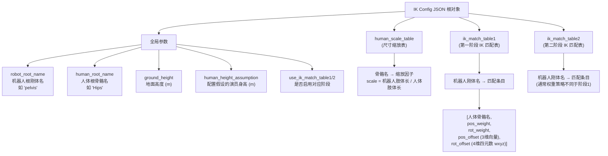
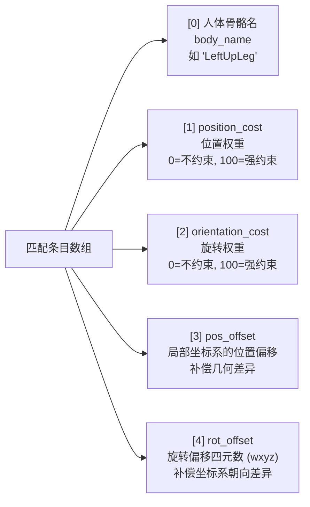
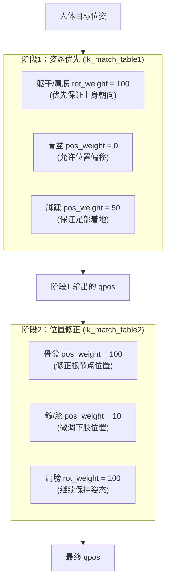
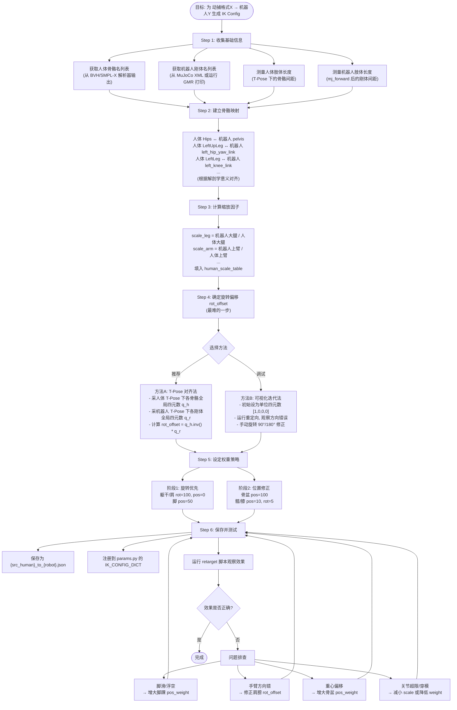

# IK Config 定义与生成指南

本文档分两部分：
1. **Part 1**：IK Config 文件的结构解析（附带代码如何读取和使用它）
2. **Part 2**：如何为新的"人体格式 → 新机器人"生成一个 IK Config（流程图 + 指导）

---

## Part 1：IK Config 文件结构

### 1.1 整体结构流程图



### 1.2 匹配条目的 5 元组含义



### 1.3 两阶段 IK 的权重设计策略



### 1.4 完整示例（bvh_nokov_to_g1.json 的骨盆条目）

```json
{
    "robot_root_name": "pelvis",
    "human_root_name": "Hips",
    "ground_height": 0.0,
    "human_height_assumption": 1.8,
    "use_ik_match_table1": true,
    "use_ik_match_table2": true,

    "human_scale_table": {
        "Hips": 0.9,
        "Spine2": 0.9,
        "LeftUpLeg": 0.9,
        "LeftArm": 0.75
    },

    "ik_match_table1": {
        "pelvis": [
            "Hips",               // 匹配人体的 Hips 骨骼
            0,                    // 位置权重 = 0 (阶段1不约束位置)
            10,                   // 旋转权重 = 10
            [0.0, 0.0, 0.0],      // 无位置偏移
            [0.5, -0.5, -0.5, -0.5]  // 旋转偏移四元数
        ]
    },

    "ik_match_table2": {
        "pelvis": [
            "Hips",
            100,                  // 位置权重 = 100 (阶段2强约束位置)
            5,                    // 旋转权重 = 5
            [0.0, 0.0, 0.0],
            [0.5, -0.5, -0.5, -0.5]
        ]
    }
}
```

### 1.5 代码中如何使用 IK Config

**加载配置（[motion_retarget.py](../general_motion_retargeting/motion_retarget.py) 第 57-81 行）：**

```python
# Load the IK config
with open(IK_CONFIG_DICT[src_human][tgt_robot]) as f:
    ik_config = json.load(f)

# 身高自适应缩放
if actual_human_height is not None:
    ratio = actual_human_height / ik_config["human_height_assumption"]
else:
    ratio = 1.0

# 调整缩放表
for key in ik_config["human_scale_table"].keys():
    ik_config["human_scale_table"][key] = ik_config["human_scale_table"][key] * ratio

# 提取配置字段
self.ik_match_table1 = ik_config["ik_match_table1"]
self.ik_match_table2 = ik_config["ik_match_table2"]
self.human_root_name = ik_config["human_root_name"]
self.robot_root_name = ik_config["robot_root_name"]
self.use_ik_match_table1 = ik_config["use_ik_match_table1"]
self.use_ik_match_table2 = ik_config["use_ik_match_table2"]
self.human_scale_table = ik_config["human_scale_table"]
self.ground = ik_config["ground_height"] * np.array([0, 0, 1])
```

**建立 IK 任务（第 107-148 行）：**

```python
def setup_retarget_configuration(self):
    self.configuration = mink.Configuration(self.model)
    self.tasks1 = []
    self.tasks2 = []

    # 遍历阶段1匹配表
    for frame_name, entry in self.ik_match_table1.items():
        body_name, pos_weight, rot_weight, pos_offset, rot_offset = entry
        if pos_weight != 0 or rot_weight != 0:
            task = mink.FrameTask(
                frame_name=frame_name,           # 机器人刚体名
                frame_type="body",
                position_cost=pos_weight,        # 位置权重
                orientation_cost=rot_weight,     # 旋转权重
                lm_damping=1,
            )
            self.human_body_to_task1[body_name] = task
            self.pos_offsets1[body_name] = np.array(pos_offset) - self.ground
            self.rot_offsets1[body_name] = R.from_quat(
                rot_offset, scalar_first=True
            )
            self.tasks1.append(task)

    # 阶段2 同理
    for frame_name, entry in self.ik_match_table2.items():
        ...
```

**应用偏移到人体数据（第 268-284 行）：**

```python
def offset_human_data(self, human_data, pos_offsets, rot_offsets):
    """pos_offsets 在局部坐标系中应用"""
    offset_human_data = {}
    for body_name in human_data.keys():
        pos, quat = human_data[body_name]
        offset_human_data[body_name] = [pos, quat]

        # 1. 先应用旋转偏移
        updated_quat = (R.from_quat(quat, scalar_first=True) *
                        rot_offsets[body_name]).as_quat(scalar_first=True)
        offset_human_data[body_name][1] = updated_quat

        # 2. 用更新后的旋转将局部位置偏移转到全局
        local_offset = pos_offsets[body_name]
        global_pos_offset = R.from_quat(updated_quat,
                                        scalar_first=True).apply(local_offset)

        # 3. 加到全局位置
        offset_human_data[body_name][0] = pos + global_pos_offset

    return offset_human_data
```

**缩放人体数据（第 243-266 行）：**

```python
def scale_human_data(self, human_data, human_root_name, human_scale_table):
    human_data_local = {}
    root_pos, root_quat = human_data[human_root_name]

    # 缩放根节点位置
    scaled_root_pos = human_scale_table[human_root_name] * root_pos

    # 在局部坐标系中缩放其他骨骼
    for body_name in human_data.keys():
        if body_name not in human_scale_table:
            continue
        if body_name == human_root_name:
            continue
        else:
            # 转到局部坐标系 (仅位置)
            human_data_local[body_name] = (
                human_data[body_name][0] - root_pos
            ) * human_scale_table[body_name]

    # 变换回全局坐标系
    human_data_global = {human_root_name: (scaled_root_pos, root_quat)}
    for body_name in human_data_local.keys():
        human_data_global[body_name] = (
            human_data_local[body_name] + scaled_root_pos,
            human_data[body_name][1]
        )

    return human_data_global
```

---

## Part 2：如何生成一个新的 IK Config

### 2.1 完整生成流程图



### 2.2 Step 1：打印机器人信息

```python
import mujoco as mj

# 加载机器人模型
model = mj.MjModel.from_xml_path("assets/unitree_g1/g1_mocap_29dof.xml")
data = mj.MjData(model)
mj.mj_forward(model, data)

# 打印所有刚体名
print("=== Robot Body Names ===")
for i in range(model.nbody):
    body_name = mj.mj_id2name(model, mj.mjtObj.mjOBJ_BODY, i)
    pos = data.xpos[i]
    print(f"  {body_name:30s} pos={pos}")

# 打印所有关节名（DoF）
print("\n=== Robot DoF Names ===")
for i in range(model.nv):
    dof_name = mj.mj_id2name(model, mj.mjtObj.mjOBJ_JOINT, model.dof_jntid[i])
    print(f"  DoF {i}: {dof_name}")
```

### 2.3 Step 3：计算缩放因子（示例代码）

```python
import numpy as np
import mujoco as mj

# --- 测量机器人肢体长度 ---
model = mj.MjModel.from_xml_path("robot.xml")
data = mj.MjData(model)
mj.mj_forward(model, data)

def body_pos(name):
    return data.xpos[model.body(name).id].copy()

robot_thigh_len = np.linalg.norm(body_pos("left_knee_link") - body_pos("left_hip_yaw_link"))
robot_shin_len  = np.linalg.norm(body_pos("left_ankle_roll_link") - body_pos("left_knee_link"))
robot_upper_arm = np.linalg.norm(body_pos("left_elbow_link") - body_pos("left_shoulder_yaw_link"))
robot_forearm   = np.linalg.norm(body_pos("left_wrist_yaw_link") - body_pos("left_elbow_link"))

# --- 人体肢体长度 (从 T-Pose BVH 或已知解剖学数据) ---
# 假设 human_height = 1.8m，标准人体比例：
human_thigh_len = 0.45   # 大腿
human_shin_len  = 0.42   # 小腿
human_upper_arm = 0.30   # 上臂
human_forearm   = 0.25   # 前臂

# --- 计算缩放因子 ---
scale_leg  = (robot_thigh_len + robot_shin_len) / (human_thigh_len + human_shin_len)
scale_arm  = (robot_upper_arm + robot_forearm) / (human_upper_arm + human_forearm)

print(f"Leg scale: {scale_leg:.3f}")   # 填入 human_scale_table 的腿部项
print(f"Arm scale: {scale_arm:.3f}")   # 填入 human_scale_table 的臂部项
```

### 2.4 Step 4：计算 rot_offset（T-Pose 对齐法）

```python
import numpy as np
import mujoco as mj
from scipy.spatial.transform import Rotation as R

# --- 人体 T-Pose 下各骨骼的全局四元数 (wxyz) ---
# 通过 BVH 解析器 + FK 得到 (参考 load_bvh_file 里的处理)
human_quat = {
    "Hips":         np.array([1.0, 0.0, 0.0, 0.0]),
    "LeftUpLeg":    np.array([...]),   # 从 BVH T-Pose 帧读取
    "LeftArm":      np.array([...]),
    # ...
}

# --- 机器人 T-Pose 下各刚体的全局四元数 (wxyz) ---
model = mj.MjModel.from_xml_path("robot.xml")
data = mj.MjData(model)
mj.mj_forward(model, data)   # 所有关节置零 = T-Pose

def body_quat(name):
    q = data.xquat[model.body(name).id].copy()  # MuJoCo 默认 wxyz
    return q

robot_quat = {
    "pelvis":               body_quat("pelvis"),
    "left_hip_yaw_link":    body_quat("left_hip_yaw_link"),
    "left_shoulder_yaw_link": body_quat("left_shoulder_yaw_link"),
    # ...
}

# --- 计算 rot_offset ---
# 目标: q_human * rot_offset = q_robot
#  => rot_offset = q_human.inv() * q_robot
def compute_rot_offset(q_h, q_r):
    r_h = R.from_quat(q_h, scalar_first=True)
    r_r = R.from_quat(q_r, scalar_first=True)
    offset = r_h.inv() * r_r
    return offset.as_quat(scalar_first=True)  # 返回 wxyz

# 映射关系
mapping = {
    # 机器人刚体名 : 人体骨骼名
    "pelvis":                 "Hips",
    "left_hip_yaw_link":      "LeftUpLeg",
    "left_shoulder_yaw_link": "LeftArm",
    # ...
}

for robot_body, human_bone in mapping.items():
    offset = compute_rot_offset(human_quat[human_bone], robot_quat[robot_body])
    print(f'"{robot_body}": rot_offset = {offset.tolist()}')
```

### 2.5 Step 5：填写 config 模板

```python
import json

config = {
    "robot_root_name": "pelvis",
    "human_root_name": "Hips",
    "ground_height": 0.0,
    "human_height_assumption": 1.8,
    "use_ik_match_table1": True,
    "use_ik_match_table2": True,

    "human_scale_table": {
        "Hips":        scale_leg,
        "Spine2":      scale_leg,
        "LeftUpLeg":   scale_leg,
        "RightUpLeg":  scale_leg,
        "LeftLeg":     scale_leg,
        "RightLeg":    scale_leg,
        "LeftFootMod": scale_leg,
        "RightFootMod": scale_leg,
        "LeftArm":     scale_arm,
        "RightArm":    scale_arm,
        "LeftForeArm": scale_arm,
        "RightForeArm": scale_arm,
        "LeftHand":    scale_arm,
        "RightHand":   scale_arm,
    },

    # 阶段1: 姿态优先
    "ik_match_table1": {
        "pelvis":                  ["Hips",        0,  10, [0,0,0], rot_offset_pelvis],
        "left_hip_yaw_link":       ["LeftUpLeg",   0,  10, [0,0,0], rot_offset_hip_l],
        "left_knee_link":          ["LeftLeg",     0,  10, [0,0,0], rot_offset_knee_l],
        "left_ankle_roll_link":    ["LeftFootMod", 50, 10, [0,0,0], rot_offset_ankle_l],
        "right_hip_yaw_link":      ["RightUpLeg",  0,  10, [0,0,0], rot_offset_hip_r],
        "right_knee_link":         ["RightLeg",    0,  10, [0,0,0], rot_offset_knee_r],
        "right_ankle_roll_link":   ["RightFootMod",50, 10, [0,0,0], rot_offset_ankle_r],
        "torso_link":              ["Spine2",      0,  100,[0,0,0], rot_offset_torso],
        "left_shoulder_yaw_link":  ["LeftArm",     0,  100,[0,0,0], rot_offset_shoulder_l],
        "left_elbow_link":         ["LeftForeArm", 0,  10, [0,0,0], rot_offset_elbow_l],
        "left_wrist_yaw_link":     ["LeftHand",    0,  10, [0,0,0], rot_offset_wrist_l],
        "right_shoulder_yaw_link": ["RightArm",    0,  100,[0,0,0], rot_offset_shoulder_r],
        "right_elbow_link":        ["RightForeArm",0,  10, [0,0,0], rot_offset_elbow_r],
        "right_wrist_yaw_link":    ["RightHand",   0,  10, [0,0,0], rot_offset_wrist_r],
    },

    # 阶段2: 位置修正
    "ik_match_table2": {
        "pelvis":                  ["Hips",       100, 5,  [0,0,0], rot_offset_pelvis],
        "left_hip_yaw_link":       ["LeftUpLeg",  10,  5,  [0,0,0], rot_offset_hip_l],
        "left_knee_link":          ["LeftLeg",    10,  5,  [0,0,0], rot_offset_knee_l],
        "left_ankle_roll_link":    ["LeftFootMod",50,  10, [0,0,0], rot_offset_ankle_l],
        "right_hip_yaw_link":      ["RightUpLeg", 10,  5,  [0,0,0], rot_offset_hip_r],
        "right_knee_link":         ["RightLeg",   10,  5,  [0,0,0], rot_offset_knee_r],
        "right_ankle_roll_link":   ["RightFootMod",50, 10, [0,0,0], rot_offset_ankle_r],
        "torso_link":              ["Spine2",     0,   10, [0,0,0], rot_offset_torso],
        "left_shoulder_yaw_link":  ["LeftArm",    5,   100,[0,0,0], rot_offset_shoulder_l],
        "left_elbow_link":         ["LeftForeArm",10,  5,  [0,0,0], rot_offset_elbow_l],
        "left_wrist_yaw_link":     ["LeftHand",   10,  5,  [0,0,0], rot_offset_wrist_l],
        "right_shoulder_yaw_link": ["RightArm",   5,   100,[0,0,0], rot_offset_shoulder_r],
        "right_elbow_link":        ["RightForeArm",10, 5,  [0,0,0], rot_offset_elbow_r],
        "right_wrist_yaw_link":    ["RightHand",  10,  5,  [0,0,0], rot_offset_wrist_r],
    },
}

with open("general_motion_retargeting/ik_configs/bvh_lafan1_to_newrobot.json", "w") as f:
    json.dump(config, f, indent=4)
```

### 2.6 Step 6：注册到 `params.py`

在 [general_motion_retargeting/params.py](../general_motion_retargeting/params.py) 的 `IK_CONFIG_DICT` 中添加：

```python
IK_CONFIG_DICT = {
    "bvh_lafan1": {
        # ... 已有条目
        "newrobot": IK_CONFIG_ROOT / "bvh_lafan1_to_newrobot.json",  # 新增
    },
}
```

同时在 `ROBOT_XML_DICT` 和 `ROBOT_BASE_DICT` 中注册新机器人：

```python
ROBOT_XML_DICT = {
    # ...
    "newrobot": ASSET_ROOT / "newrobot" / "newrobot.xml",
}

ROBOT_BASE_DICT = {
    # ...
    "newrobot": "pelvis",  # 根刚体名
}
```

### 2.7 调优 Cheat Sheet

| 现象 | 可能原因 | 解决方案 |
|------|---------|---------|
| 脚在地上滑动 | 脚踝位置权重过低 | `ankle_pos_weight` 从 50 提至 100 |
| 机器人悬浮 | `ground_height` 不对 | 调整该值或启用 `offset_to_ground=True` |
| 手臂方向反了 | `rot_offset` 错误 | 对肩膀的 `rot_offset` 绕 Z 旋转 180° |
| 膝盖反折 | 小腿方向错误 | 修正 `left_knee_link` / `right_knee_link` 的 `rot_offset` |
| 重心左右摆 | 骨盆位置约束太弱 | 阶段2 `pelvis_pos_weight` 提至 100+ |
| 关节抖动 | IK 解不稳定 | 提高 `damping`（默认 5e-1），或减少 `max_iter` |
| 上身僵硬 | 躯干/肩膀权重过大 | 调低 `torso_link` / `shoulder` 的 `rot_weight` |
| 超出关节限位 | 缩放过大或权重冲突 | 降低 `human_scale_table` 对应项，或检查 XML 的 joint range |

### 2.8 常用旋转偏移速查

```python
# 单位四元数（无偏移）
[1.0, 0.0, 0.0, 0.0]

# 绕 X 轴旋转 90°
[0.7071, 0.7071, 0.0, 0.0]

# 绕 Y 轴旋转 90°
[0.7071, 0.0, 0.7071, 0.0]

# 绕 Z 轴旋转 90°
[0.7071, 0.0, 0.0, 0.7071]

# 绕 Z 轴旋转 180° (左右翻转常用)
[0.0, 0.0, 0.0, 1.0]

# 绕 X 轴旋转 180° (上下翻转)
[0.0, 1.0, 0.0, 0.0]

# 组合: Y-up → Z-up 的常见变换
[0.5, -0.5, -0.5, -0.5]   # 出现在大多数 BVH→G1 config 中
```

---

## 附录：文件路径索引

- **Config 文件目录**：`general_motion_retargeting/ik_configs/`
- **Config 注册表**：[general_motion_retargeting/params.py](../general_motion_retargeting/params.py)
- **Config 加载和使用**：[general_motion_retargeting/motion_retarget.py](../general_motion_retargeting/motion_retarget.py)
- **BVH 解析器**：[general_motion_retargeting/utils/lafan1.py](../general_motion_retargeting/utils/lafan1.py)
- **参考示例配置**：
  - [bvh_lafan1_to_g1.json](../general_motion_retargeting/ik_configs/bvh_lafan1_to_g1.json)
  - [bvh_nokov_to_g1.json](../general_motion_retargeting/ik_configs/bvh_nokov_to_g1.json)
  - [smplx_to_g1.json](../general_motion_retargeting/ik_configs/smplx_to_g1.json)
